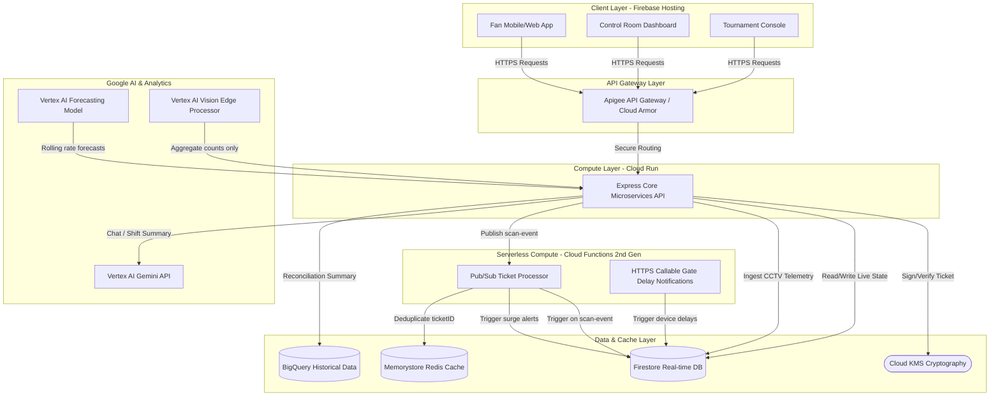

# System Architecture: Smart Stadiums & Tournament Operations

This document describes the architectural framework and data flow topologies of the **SSTOps** platform. The entire stack is built exclusively on **Google Cloud Platform (GCP)** services and Google AI technologies.

---

## 1. High-Level Component Map

The following Mermaid diagram outlines the service interfaces and data flows between the Fan App, Operations Dashboard, and Tournament Management Console.

---

## 2. Deep-Dive Component Responsibilities

### A. Client Layer (Firebase Hosting)
- Serves the compiled React / Material 3 SPA.
- Implements responsive views for three separate roles: fans, control room staff, and tournament coordinators.
- Connects directly to Firestore real-time listeners for live heatmap overlays and immediate surge warnings.

### B. Compute Layer (Cloud Run & Cloud Functions 2nd Gen)
- **Cloud Run (Express REST Backend)**:
  - Serves as the central API gateway.
  - Implements ticketing operations, Gemini translation/summarization routes, and scheduling conflict evaluations.
  - Fully stateless, containerized, scaling from `min-instances=0` for tournament operations to keep costs low, and capable of high concurrency during event hours.
- **Cloud Functions 2nd Gen (Event-Driven)**:
  - Subscribes to the `gate-scans` Pub/Sub topic to decouple heavy analytical tasks.
  - Handles writing of scan logs to Firestore and evaluates rolling entrance metrics.
  - Triggers push alerts (FCM logs) upon gate congestion or delay status changes.

### C. Data & Cache Layer
- **Firestore**: Holds active seat allocations, logged incidents, live gate flow rates, and active schedule rosters. Fires real-time event updates to the Control Room screen.
- **Memorystore (Redis)**: Acts as a high-speed gate deduplication buffer to prevent replay scanning attacks.
- **Cloud KMS**: Signs ticket QR codes using secure cryptographic HMAC hashes to guarantee ticket integrity.
- **BigQuery**: Acts as the offline analytics warehouse, storing gate logs, registration data, and matching history for post-tournament report compilations.

### D. Google AI & Machine Learning Services
- **Vertex AI Gemini API**:
  - Powers the multilingual fan chat assistant (supporting Hindi, Marathi, and English).
  - Summarizes incident reports during command center shift handovers.
  - Compiles comprehensive post-tournament reconciliation reports.
- **Vertex AI Vision**:
  - Counts crowd counts at the venue edge and publishes aggregate telemetry. Crucially, **zero raw video data leaves the local venue network**, guaranteeing maximum fan privacy.
- **Vertex AI Forecasting**:
  - Examines sliding-window scan velocities to predict queue overloads 15-30 minutes in advance, enabling proactive staff redeployment.

---

## 3. Security & Compliance (Zero Trust)
- **Service-to-Service IAM Auth**: Inter-service communication (e.g. Cloud Run calling Firestore, Pub/Sub calling Cloud Functions) is fully authenticated using dedicated GCP service accounts and IAM permission limits. No shared API secrets or passwords are used.
- **Structured Log PII Redaction**: The Express logging middleware automatically scans and scrubs PII fields (phone numbers, user profiles, email logs) before forwarding data to Google Cloud Logging.
- **Firestore Security Rules**: Field-level validation rules ensure that fans can only read their owned tickets and profiles, while staff credentials are required to manipulate incidents, gate states, and schedules.
